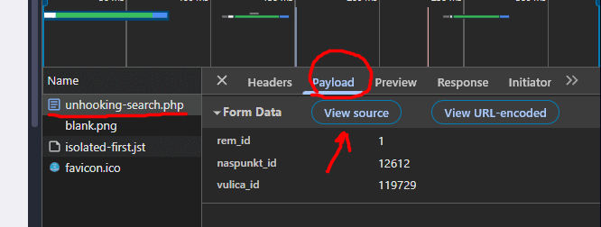
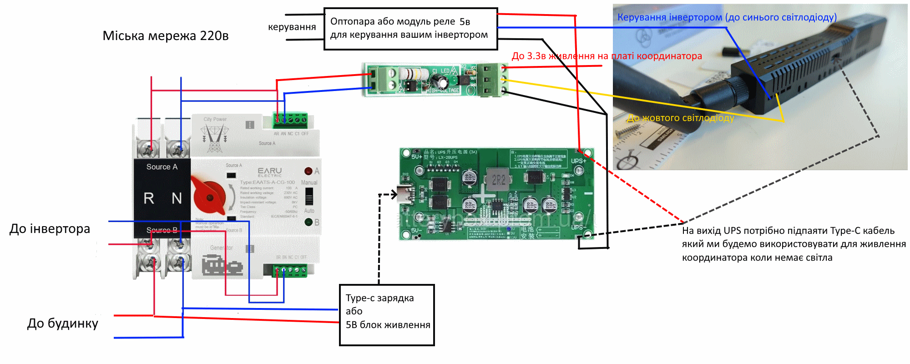
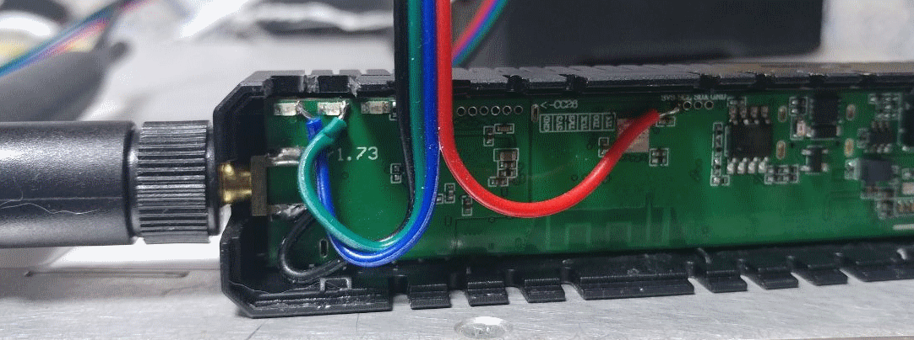
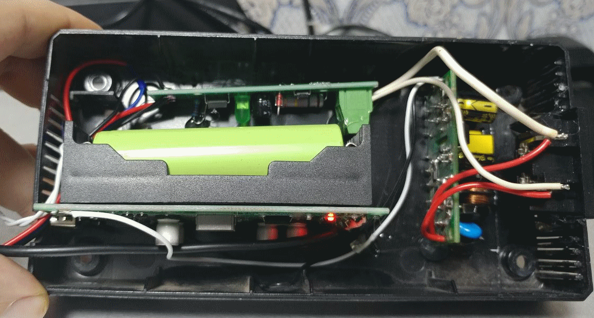

# Ідея
В моєму будинку (як і в більшості) нема окремих ліній 220в під бойлер/пральну машину/мікрохвильовку і.т.д. 
Ідея полягає у використанні режиму Zigbee Hub та зігбі розеток для того щоб керувати "потужними" споживачами що дозволяє використовувати відносно слабкий інвертор (1,5кВт в моєму випадку). 
Оскільки координатор не має ніяких виведених GPIO то я вирішив підпаятись до доступних світлодіодів (жовтий та синій). 
В чому полягає профіт? Вам не потрібно мати систему розумного будинку, тільки координатор і пару зігбі реле/розеток.

# Що робить цей скрипт?
- Парсить графік відключень житомиробленерго
- Вимикає вказані зігбі розетки за 5хв до початку відлючення
- Вмикає інвертор за 5хв до відключення або негайно якщо живлення вимкнено не за графіком
- Вимикає інвертор та вмикає споживачів коли світло дали (але не раніше закінчення відключення за графіком)

# Список необхідних компонентів
- Прямі руки та мінімальні навички пайки
- Координатор SLZB-06x або U серії. **УВАГА! Координатори SLZB-06M не підійдуть! Це буде працювати тільки з координаторами без префіксу М!**
- Версія SLZB-OS v3.1.6.dev4 або вище
- Встановлений Автомат введення резерву (АВР). Має бути автоматичний а не ручний! Наприклад [https://brain.com.ua/ukr/Avtomatichniy_vimikach_YRO_YRQ2PC-125-3P-p1278548.html](https://prom.ua/ua/p2436945505-avtomaticheskij-vyklyuchatel-rezervu.html)
- Окрема розетка підключена до міської мережі (в обхід АВР, на якій напруга присутня тільки коли є напруга в міській мережі)
- Модуль датчика 220в. Наприклад https://arduino.ua/ru/prod2141-detektor-napryajeniya-220v
- Модуль UPS на 5в. Наприклад https://prom.ua/ua/p2245297275-plata-dbzh-volt.html

# Про сетап
Я використовую SLZB-06p7U в якості координатора. За перемикання живлення на резервне і назад відповідає АВР TOMZN. Для живлення координатора я придбав модуль UPS на 5В.
Я прокинув окрему лінію яка підключена перед АВР (не резервовану) і підключив до неї зарядні пристрої для заряду батарей та датчик 220в. Це потрібно щоб мати змогу моніторити наявність мережі і щоб акумулятори заряжались тільки від міської мережі. 
Я придбав модуль UPS який не має на виході USB/Type-C тому мені довелось "розкурочити" один кабель і примаяти його на вихід. Але краще брати UPS роз*ємами на виході :)

# Стосовно пінів (GPIO)
Для SLZB-06/p7/p10 (та для їх U версій) пін на інвертор: 46 (синій світлодіод) а на датчик 220: 45 (жовтий світлодіод)

# Налаштування
- Першим кроком вам потрібно увімкнути режим Zigbee Hub (beta) на сторінці вибору режимів.
- Далі вам потрібно перейти в меню "Zigbee Hub" і сторінку "Devices". Натисніть кнопку "+"
- Спарте реле/розетки і дайте їм імена (натисніть на "олівець" навпроти пристрою)
- Після спарювання всіх пристроїв перейдіть в "Dashboard", ви маєте терер бачити пристрої тут, з елементами керування.
- Встановіть опцію "Power on state" в "OFF" для кожного пристрою. **Це важливо! Ми не хочемо щоб при несподіваному відключенні всі "потіжні" споживачі виявились увімкненими!**
- Перейдіть на сторінку "LEDs settings" і увімкніть опцію "Disable all LEDs". Це потрібно щоб OS не вмикала світлодіоди, щоб не було хибних спрацювань
- Далі перейдіть на сторінку "Scripts and Automations" і натисніть "+" щоб створити скрипт. Назвіть його **parser.be** і скопіюйте туди вміст скрипту **parser.be** з цього репоиторію.
- Вам потрібно дізнатись посилання для вашого житомиробленерго. Це можна зробити за допомогою інструментів розробника у вашому браузері. Для цього переходите на https://www.ztoe.com.ua/unhooking-search.php вибираєте ваш РЕМ, населений пункт і вулицю. Завантажиться графік відключень. Відкрийте інструменти розробника і перезавантажте сторінку, ви побачите в списку запит до **unhooking-search.php** вам потрібно натиснути на нього, вибрати **payload**, і натиснути **View source**. Скопіюйте текст, він має виглядати ось так **rem_id=1&naspunkt_id=12711&vulica_id=129719**

- Вставте отриманий текст в змінну **postData**
- Змініть цифру в змінній **row** на номер рядка вашої черги в таблиці і збережіть скрипт.
- Створіть ще один скрипт з назвою **commander.be** і скопіюйте в нього текст з файлу **commander.be** в цьому репозиторії.
- Знайдіть змінну **devices**, це розетки/реле якими ми будемо керувати. Замініть імена девайсів на свої. За необхідності додайте нові або видаліть зайві девайси.
- Після того як все підключено, запустіть скрипт **commander.be**

# Схема
Загальна схема підключення нижче: 

# Фото
Бокорізами я вирізав отвір під кабель в корпусі координатора і припаявся до GND (копус SMA коннектора антени), синього та жовтого світлодіодів, до живлення 3.3в. 
Підпайка саме до 3.3в потрібна щоб коректно працювала підтяжка датчика 220в, якщо ви замість 3.3в **підключите 5в то пошкодите координатор!**

Я помістив UPS, датчик 220в, плату БЖ 220в та оптопару в корпус від зламаного зарядного пристрою 

Мій інвертор має вхід з керуванням логічним рівнем тому я використовую просто оптопару для керування ним. Оптопара напряму припаяна до синього світлодіоду. Якщо ваш інвертор не має такого входу то вам потрібно підключити релейний модуль, наприклад [модуль реле 3.3в](https://prom.ua/ua/p2443255329-modul-rele-33v.html)
